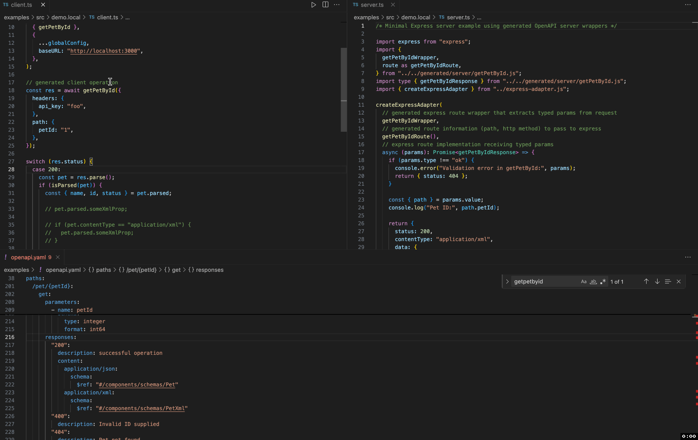

# Introduction

@apical-ts/craft effortlessly turn your OpenAPI specifications into
**fully-typed Zod v4 schemas** ready for runtime (client or server) validation
and TypeScript development.

You may ask: why another Typescript OpenAPI generator? The answer lies in full
commitment to **strict type safety**. With @apical-ts/craft, you get:

- no exceptions at runtime for client operations
- no accidental access to properties that can be `undefined`
- discriminated unions for polymorphic schemas
- full support for multiple success responses (`201`, `202`) with payload
- full support for multiple content types (json, xml, form data, etc.)
- full support for wildcards responses (e.g., `2XX`, `4XX`)
- full support for circular references in schemas
- easy to debug operations with rich errors
- precise Zod schemas for request and response validation with comprehensive
  OpenAPI support

## Quick Start

Get started with @apical-ts/craft in just a few commands:

```bash
# Generate schemas and client from an OpenAPI specification
npx @apical-ts/craft generate \
  --server \
  --client \
  -i https://petstore.swagger.io/v2/swagger.json \
  -o generated

# Install runtime dependencies for the generated code
cd generated
npm install
```

This will create:

- **`server/`** - Typed handler wrappers
- **`client/`** - Individual operation functions for each API endpoint
- **`schemas/`** - Zod schemas and TypeScript types

:::note

The generated client and server code requires `zod` as a runtime dependency for
schema validation. Make sure to install it in your project.

:::

## Live Demo

Explore the live demo to see @apical-ts/craft in action:

<iframe style={{ width: "100%", minHeight: "600px", height: "600px" }}
src="https://stackblitz.com/edit/vitejs-vite-bls6sznb?ctl=1&embed=1&file=src%2Fclient.ts&view=editor&theme=dark"></iframe>

<!--  -->

## Why another generator?

We all like the developer experience of [tRPC](https://trpc.io/), but not always
we're in control of the backend. OpenAPI specifications provide a powerful way
to define your API contracts, and with @apical-ts/craft, you can easily generate
TypeScript code that strictly adheres to those contracts, all while enjoying a
seamless developer experience.

Many existing generators lack flexibility and strong type safety. Most do not
support multiple success responses or multiple content types, and their typings
are often too loose—making it easy to accidentally access undefined properties.
With **stricter** guardrails, @apical-ts/craft helps developers (and Gen-AIs)
build more robust and reliable implementations.

Curious why you should choose this generator over others? See our
[comparison with alternative libraries](./comparison-with-alternative-libraries.md)
for more details or check our comprehensive feature list for more information.

## Key Features

- 🎯 **Operation-based architecture** - Each API operation becomes a standalone,
  typed function
- 🛡️ **Runtime validation** - Built on Zod v4 for robust type safety and
  validation
- 🔄 **Multiple content types** - Full support for JSON, XML, form data, and
  more
- 📝 **OpenAPI compatibility** - Supports OpenAPI 2.0, 3.0.x, and 3.1.x
  specifications
- 🚀 **Zero dependencies** - Generated code has minimal runtime dependencies
- 🧪 **Self-contained schemas** - Generated Zod schemas can be used
  independently
- ✅ **Comprehensive testing** - Thoroughly tested with a full test suite

## Next Steps

- Learn how to use the [CLI tool](cli-usage)
- Dive into [client generation](client-generation/define-configuration) to build
  type-safe API clients
- Check out our comprehensive feature documentation for a complete overview
