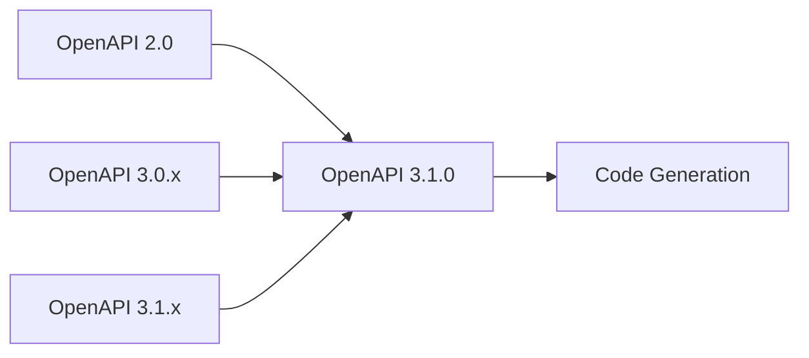

# Supported Input Formats

@apical-ts/craft provides comprehensive support for various OpenAPI
specification formats, automatically handling format conversion and
normalization to ensure compatibility.

## Supported Versions

The generator automatically detects and converts different OpenAPI specification
versions:

### OpenAPI 2.0 (Swagger)

- **File extensions**: `.json`, `.yaml`, `.yml`
- **Conversion**: Automatically converted to OpenAPI 3.0, then to 3.1
- **Support level**: ✅ Full support with automatic conversion

### OpenAPI 3.0.x

- **File extensions**: `.json`, `.yaml`, `.yml`
- **Conversion**: Automatically converted to OpenAPI 3.1
- **Support level**: ✅ Full support with automatic conversion

### OpenAPI 3.1.x

- **File extensions**: `.json`, `.yaml`, `.yml`
- **Conversion**: No conversion needed
- **Support level**: ✅ Native support

## Format Detection

The generator automatically detects the format based on:

1. **File content analysis** - Examines the specification structure and version
   fields
2. **MIME type detection** - For remote URLs, respects content-type headers
3. **File extension hints** - Uses file extensions as secondary indicators

## Input Sources

### Local Files

```bash
# Local YAML file
pnpx @apical-ts/craft generate -i ./openapi.yaml -o ./generated

# Local JSON file
pnpx @apical-ts/craft generate -i ./swagger.json -o ./generated

# Relative paths
pnpx @apical-ts/craft generate -i ../specs/api.yaml -o ./generated

# Absolute paths
pnpx @apical-ts/craft generate -i /home/user/project/openapi.yaml -o ./generated
```

### Remote URLs

```bash
# HTTPS URLs
pnpx @apical-ts/craft generate \
  -i https://petstore.swagger.io/v2/swagger.json \
  -o ./generated

# Raw GitHub files
pnpx @apical-ts/craft generate \
  -i https://raw.githubusercontent.com/user/repo/main/openapi.yaml \
  -o ./generated

# API documentation endpoints
pnpx @apical-ts/craft generate \
  -i https://api.example.com/openapi.json \
  -o ./generated
```

## Normalization Process

All input formats undergo automatic normalization to OpenAPI 3.1.0 before code
generation:



### Benefits of Normalization

1. **Consistent Processing** - All specifications are processed using the same
   logic
2. **Latest Features** - Takes advantage of OpenAPI 3.1.x enhancements
3. **JSON Schema Compatibility** - OpenAPI 3.1.x uses JSON Schema draft 2020-12
4. **Better Type Safety** - More precise type definitions and validations

## Reference Resolution

The generator automatically resolves external references:

### Local References

```yaml
# References to local files
$ref: './schemas/user.yaml#/User'
$ref: '../common/errors.yaml#/Error'
```

### Remote References

```yaml
# References to remote files
$ref: 'https://api.example.com/schemas/common.yaml#/Error'
$ref: 'https://raw.githubusercontent.com/user/schemas/main/user.yaml#/User'
```

### Internal References

```yaml
# References within the same document
$ref: '#/components/schemas/User'
$ref: '#/components/responses/NotFound'
```

## File Format Examples

### YAML Format

```yaml
openapi: 3.1.0
info:
  title: Sample API
  version: 1.0.0
paths:
  /users:
    get:
      summary: List users
      responses:
        "200":
          description: Success
          content:
            application/json:
              schema:
                type: array
                items:
                  $ref: "#/components/schemas/User"
components:
  schemas:
    User:
      type: object
      properties:
        id:
          type: integer
        name:
          type: string
```

### JSON Format

```json
{
  "openapi": "3.1.0",
  "info": {
    "title": "Sample API",
    "version": "1.0.0"
  },
  "paths": {
    "/users": {
      "get": {
        "summary": "List users",
        "responses": {
          "200": {
            "description": "Success",
            "content": {
              "application/json": {
                "schema": {
                  "type": "array",
                  "items": {
                    "$ref": "#/components/schemas/User"
                  }
                }
              }
            }
          }
        }
      }
    }
  },
  "components": {
    "schemas": {
      "User": {
        "type": "object",
        "properties": {
          "id": {
            "type": "integer"
          },
          "name": {
            "type": "string"
          }
        }
      }
    }
  }
}
```

## Validation and Error Handling

The generator includes robust validation and error handling:

- **Schema Validation** - Validates OpenAPI specifications against official
  schemas
- **Reference Resolution** - Handles missing or invalid references gracefully
- **Format Detection** - Provides clear error messages for unsupported formats
- **Network Errors** - Handles timeouts and connection issues for remote URLs

## Best Practices

1. **Use Specific Versions** - Pin OpenAPI versions in your specifications for
   consistency
2. **Validate Before Generation** - Use OpenAPI validators to catch issues early
3. **Organize References** - Keep external references organized and accessible
4. **Version Control** - Store specifications in version control for
   reproducibility
5. **Documentation** - Include clear descriptions and examples in your
   specifications
